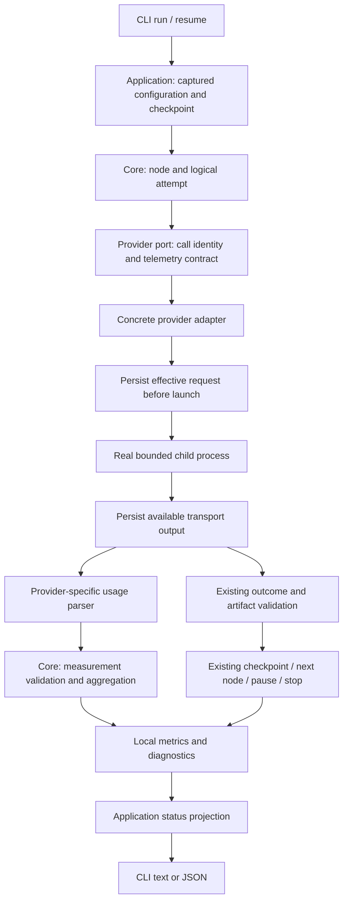

# Proposed design and dependencies

Everything below is planned, unless explicitly labelled existing. Read [research](research.md) before translating provider fields.

## Ownership and flow



Core contracts and policy must not import a concrete CLI protocol, filesystem adapter or CLI formatter. Provider parsers own protocol knowledge; storage owns serialization/atomic writes; the status application owns aggregation. Use existing ports and add optional capabilities compatibly. Extract focused modules rather than enlarging execute-workflow.ts with provider branches.

## Proposed on-disk layout

Paths are relative to the target project. Existing files retain their purposes; the new `calls/` directory makes the call correlation unambiguous.

```text
.nodulus/runs/<run-id>/
  run.json                          # existing authoritative checkpoint
  events.jsonl                      # existing + timestamps, sequence and call links
  metrics.json                      # existing array + additive versioned row fields
  pricing.json                      # new optional frozen estimate policy/rate snapshot
  nodes/<node-id>/attempt-N/
    invocation.json                 # existing logical request/config metadata
    prompt.md                       # existing base node instructions
    response.raw.txt                # existing adapter-returned outcome text
    validation.json                 # existing exact validation issues
    result.json                     # existing accepted outcome
  nodes/<node-id>/artifacts/         # existing validated deliverables
  calls/<call-id>/
    request.json                    # new safe command metadata and correlation
    stdin.txt                       # new effective UTF-8 provider request
    transport.json                  # new bounded stdout/stderr/exit diagnostics
    telemetry.json                  # new reported data, normalized data, coverage
  provider/<node-id>/...             # existing transport paths retained for compatibility
```

Each new request carries `schemaVersion: 1`, run/node IDs, logical attempt, call ID, operation (`invoke` or `repair_response`), parent call ID where applicable, requested model/profile, safe executable arguments, cwd and input capture status. An adapter-specific original attempt or repair index is additional metadata, never the primary accounting key. Link existing invocation/transport records to the new call record; do not rename historical directories.

Persist the exact effective stdin after adapter suffixes or repair feedback are assembled, before spawning the inference process. This is distinct from prompt.md. Include Unicode/newlines without shell interpolation. Do not persist environment variables, credentials or unrestricted configuration objects. Configuration metadata uses the existing allowlist. Prompt/output files are sensitive user content; keep them local and out of Git. They are not automatically secret-free. Do not promise generic redaction while claiming byte-exact capture.

For this slice, metadata is written before launch and output/telemetry at process settlement. A hard host crash may leave a started call with no output. Status must say interrupted/incomplete; continuous crash-resistant stream flushing is deferred. Preserve existing timeout and output limits. Record capture status (`complete`, `truncated`, `unavailable`) and the applied byte limit; do not invent a total received byte count if it was not observed.

## Identity, time and failure behavior

- Allocate call identity before provider invocation. Readiness probes are not inference calls: a prelaunch failure has `launched: false`, null usage and a diagnostic. Never charge it as a completed model call.
- Every new runtime event has a UTC ISO timestamp and a monotonically increasing per-run sequence under the existing run lock. Sequence determines order; equal timestamps or clock rollback must not reorder events. Keep optional legacy events readable.
- Call records carry start/end wall-clock timestamps, nonnegative monotonic elapsed time and optional provider-reported duration separately. Wall-clock duration is not model compute time. Artifact validation duration is not provider inference duration.
- Give new metrics rows stable call IDs and upsert by ID when finalizing; repeated status/resume must not append the same call again. No exactly-once guarantee is claimed across external process crashes. Never replay a writing provider operation just to finish telemetry.
- Missing/malformed usage fields produce measurement diagnostics and null values, independently of artifact acceptance. A malformed provider response still follows the existing provider/outcome error path.
- Request-record persistence failure before launch stops safely with no provider call. A failure after provider execution retains any checkpoint/evidence successfully saved and surfaces an actionable diagnostic; do not automatically retry inference or claim rollback. Preserve the existing runtime's storage-error semantics.
- Replace or extend last-call telemetry with a call-keyed result/read capability. Keep the public `invoke(): Promise<string>` and legacy optional usage hook usable. Clear last-call state before readiness and every invocation/repair, including throwing paths, so a failed call cannot inherit a previous call's usage.

## Measurement contract

Keep the existing `metrics.json` array and legacy row keys (`nodeId`, `attempt`, `usage`, `elapsedMs`). Add `schemaVersion`, `callId`, operation, provider kind/CLI version, requested/reported model, timestamps, launch/outcome status, record references and telemetry diagnostics. Optional provider methods and additive fields must not require custom ProviderPort implementations to change.

The proposed telemetry detail contains:

| Field group | Meaning |
| --- | --- |
| Source | `provider_event`, `legacy_adapter` or `unavailable`; event type/IDs, CLI version, parser version and run-relative transport reference |
| Reported counters | Valid nonnegative safe-integer input/output/cache-read/cache-write/reasoning fields as reported; missing, negative, fractional, nonfinite or unsafe values become null with diagnostics |
| Semantics | Input cache inclusion and output reasoning inclusion: `included`, `excluded`, or `unknown`; never assume all providers match |
| Normalized counters | Inclusive input/output totals only where the source semantics are verified; preserve independent known cache/reasoning counters even when total is unknown |
| Coverage | `complete`, `partial`, `unavailable`, or `invalid`, with reasons and known internal-step IDs/count; completeness is relative to the supported CLI protocol, not a billing audit |
| Money | Provider-reported USD, optional estimated USD, estimation provenance; actual billed USD remains unavailable in this slice |

Legacy input/output fields receive normalized inclusive values for new concrete-adapter records. Preserve historical/custom-adapter values without pretending their semantics were verified; mark them legacy. `usage.costUsd` remains provider-reported USD only. Estimates live in a separate field and never silently replace it. Missing usage is null, including calls which return a valid artifact.

Codex: collect terminal turn usage, excluding item/delta counters. Cursor: optional usage in its selected terminal result, never arbitrary nested tool output. OpenCode: collect unique step-finish parts across the call, including intermediate model steps, instead of counting only the message selected for the final artifact. Do not also add assistant-level totals. Deduplicate using scoped source IDs; where the protocol lacks IDs, use the documented single terminal record or parser-local turn ordinal. Identical retransmission is counted once; conflicting duplicates or unassignable extra terminals produce partial/invalid coverage rather than an invented sum.

Numeric fields alone do not prove cache/reasoning relationships. Before enabling a provider's inclusive conversion or pricing, attach upstream/version evidence to its fixture manifest. For an unverified relationship, preserve reported counters but leave the corresponding normalized total/estimate null. This is a valid supported outcome, particularly for optional Cursor fields.

## Status and legacy compatibility

Extend the existing status result with per-call/per-node usage, provider/model grouping and field-level coverage (`knownCalls`, `totalCalls`, `knownSubtotal`, `total`). A total is numeric only when that field is known with complete coverage for every applicable launched call. Otherwise total is null and the subtotal is explicitly partial. No launched calls gives subtotal 0 but total null with reason `no_calls`, not a zero-cost provider measurement. Do not combine incompatible counter semantics into an apparently comparable subtotal.

Group unknown reported models separately from requested model labels. Count repairs as separate calls and include their cost. An artifact failure can still consume tokens. Status and resume are read-only with respect to historical metrics: no provider process or telemetry migration merely to inspect a run.

Read old rows and old untimestamped events. Missing optional metrics file means unavailable; a malformed metrics file or complete invalid JSONL event yields an explicit diagnostic, not a clean empty history. Retain trailing incomplete-line diagnostics. An interrupted call remains incomplete unless later evidence already in the run safely resolves it. Checkpoint state remains authoritative for resume.

## Optional price estimates

Proposed configuration: an optional `observability.pricing` entry in project settings with an explicitly selected local rate-card file and billing mode (`api`, `subscription`, `local`, `unknown`). Validate it through the existing settings boundary; copy the validated policy and rate card to pricing.json at run creation. Resume uses that snapshot even if the project file changes. Missing policy disables estimation. An explicitly configured invalid policy fails preflight before inference.

Each rate entry declares provider, exact reported model (no guessed aliases), currency USD, billing category/unit, rates per million tokens, effective date, source URL or user-supplied provenance, and an ID. Store the snapshot hash and estimator version with every estimate. No network access is required. Subscription/local modes may show an explicitly requested API-equivalent estimate, labelled as such; default to unknown cost. Do not convert credits to dollars or infer a free run from local execution.

Price only verified disjoint buckets. For the synthetic test model with inclusive input 1000, cache-read 200, no cache writes, inclusive output 100 (reasoning 20 is already included), and fictional rates of USD 2/1/4 per million uncached-input/cache-read/output tokens:

```text
estimate = ((1000 - 200) * 2 + 200 * 1 + 100 * 4) / 1_000_000
         = USD 0.0022
```

Do not bill reasoning twice. Cache writes require a verified relationship and matching rate; missing rates, model identity, counters or semantics yield null with a reason, not zero. Preserve an explicit reported zero as reported evidence without claiming zero total operating expense. Never add an estimate and a reported cost for the same call; expose them as separate views. Round only for display, retaining reproducible values and a defined numeric tolerance in tests.
