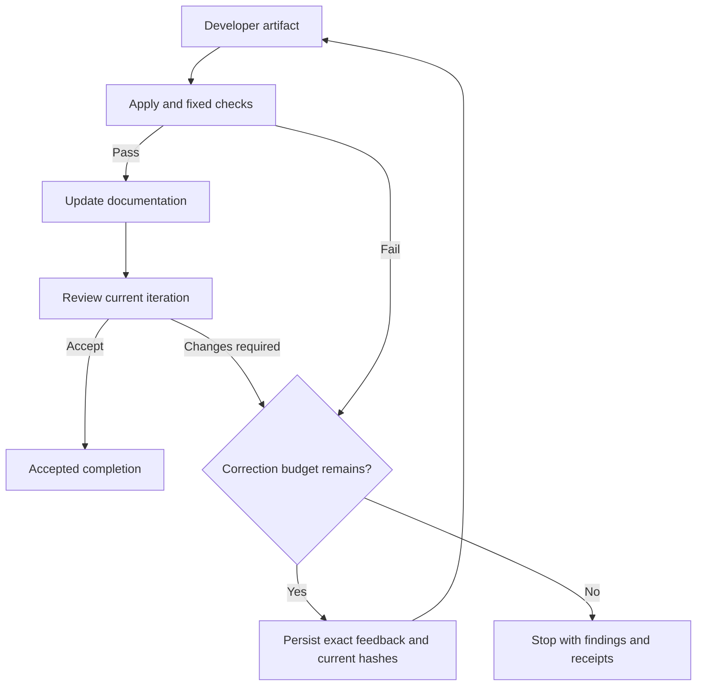

# Planned: reviewer feedback returns to the developer

Status: **initial bounded review-revision slice implemented** on 2026-09-29 after explicit user authorization. See [execution evidence and remaining limits](qwen-review-loop-report.md). The design below includes later behavior that is still pending.

## What exists

The original development workflows are sequential. The new `nodulus-task loop` controller wraps separate Nodulus runs and routes valid review rejection back to code. In the task helper, `runPhase` rejects a review whose decision is not `accept`. It does not route the findings back to the builder. A completed code phase cannot be replayed. Phase recovery in PR #15 verifies accepted evidence and generates documentation/review or review-only continuation; it does not reopen accepted code for rework. The globally installed CLI observed during the benchmark was 2.1.0-dev.5 and did not include the newer task helpers.

Schema/response repair is separate: it corrects an invalid response envelope when the provider supports safe response-only repair. It is not a developer revision prompted by a valid `changes_required` review.

## Intended user scenario

Given a small approved packet with a frozen test, allowlisted code/document paths, fixed checks and a correction limit, the developer proposes an artifact. After application and checks, documentation and review follow. If the reviewer names a concrete defect, a controller captures the findings and starts a new development iteration against the current file hashes. The developer fixes it, checks run again, documentation is refreshed, and a fresh review evaluates that iteration. Acceptance completes the packet; exhaustion stops with evidence for the user.

This remains the desired full flow. The initial implementation routes review rejection; failed checks stop instead of revising, and interrupted runs require inspection instead of automatic continuation. An optional final stronger reviewer must follow the same explicit accept/rework/stop policy; its rejection cannot silently be ignored.

## Smallest useful design

Start with a bounded controller around existing Nodulus runs, preserving the current one-primary-file packet limit. Keep it provider-neutral. Repository configuration selects Qwen and supplies commands; product code must not contain model aliases, benchmark fixture names or repository-specific checks.

- Capture `executionId`, packet/context fingerprint, frozen test hash, allowed paths, fixed check IDs and `maxCorrections` before inference. An initial iteration plus at most two revisions is an example policy, not an unbounded loop.
- Give every iteration and phase its own identity and immutable receipts. Store the originating review, structured findings and exact target artifact hashes. Prior acceptance remains historical evidence; it is not acceptance of the revised code.
- Feed the builder the current source, exact executable failures/review findings and original acceptance requirements. Do not change the test or broaden scope to satisfy a reviewer.
- Apply a new artifact only once against its expected base. Verify test/reference hashes before and after checks. Changing implementation invalidates that iteration's documentation/review acceptance and requires fresh checks and review.
- A reviewer produces findings and a decision; it has no source-write permission. Contradictory or out-of-scope findings stop for operator input rather than expanding the assignment.
- Persist the transition before scheduling the next call. Resume uses the last durable transition and never reapplies a completed write or launches the same accepted phase again.
- Stop on correction exhaustion, unsafe scope changes or missing evidence. Preserve the current diff and all attempts. Never reset or delete execution state to bypass completed-phase guards.
- Count primary and response-repair boundary calls separately and record available usage. A revision limit and per-call timeout are not a hard token budget. CLI-internal calls may only be visible afterward; do not promise an enforceable pre-inference token cap without adapter support.

## Scenario and test plan

Use production workflow entry points, real temporary files, executable checks and persisted state. Replace only external inference. Observe relevant RED before implementation. Do not use model self-reported test success as proof.

| ID | Given / when | Required observation |
| --- | --- | --- |
| REWORK-001 | First code artifact passes initial checks; reviewer reports a defect; developer revises; new checks/review accept | Two distinct development iterations, findings included in the second request, one application per artifact, unchanged frozen test, receipt bound to the final artifact |
| REWORK-002 | Reviewer keeps requesting the same fix and limit is two corrections | Exactly initial plus two development iterations; no fourth development call; terminal exhaustion with all findings and available usage |
| REWORK-003 | Checks fail after applying a model proposal | Actual stdout/stderr/exit status reaches the next bounded iteration; no advancement to accepted documentation/review before checks pass |
| REWORK-004 | Revised output changes tests, escapes paths, uses a stale base or requests an unauthorized command | Rejected before the unsafe action; no scope expansion; evidence preserved |
| REWORK-005 | Review rejects code after documentation was accepted | Revised implementation gets refreshed documentation and new review; old acceptance cannot complete the new iteration |
| REWORK-006 | A process stops after writing the review transition or after applying the revision | Fresh-process resume continues from durable state without duplicate inference/application; use process/file synchronization rather than long sleeps |
| REWORK-007 | Invalid review JSON versus valid `changes_required` with actionable findings | Response-only repair and development revision remain different operations, with separate identities and bounded accounting |
| REWORK-008 | Final stronger review rejects, or findings need clarification outside the approved scope | Follow captured revision policy or pause for user input; never silently mark the packet accepted |

Run fixed focused tests, lint/typecheck, full quality checks and real installed-package acceptance before delivery. Document any hosted/configuration exception explicitly. The two-function model benchmark is only a capability signal; it does not satisfy these workflow scenarios.

## Completion criteria

- [ ] Runtime/controller and durable round records implemented through observed scenario RED/GREEN.
- [x] Review rejection automatically reaches a developer with the exact findings (six-call fixture and controlled live local-Qwen proof).
- [ ] Tests remain frozen; checks and documentation rerun for changed implementation.
- [ ] Limits and resume prevent infinite work and duplicated actions.
- [ ] One controlled live localhost run completes a review-requested revision without coordinator code edits.
- [ ] Execution report compares interventions, accepted-without-edit rate, calls, tokens and elapsed time with prior supervised runs.

If the live run still needs coordinator coding, report that as a failed autonomy criterion and narrow the assignment or reevaluate the local configuration. Do not conceal the intervention or continue retrying indefinitely.
